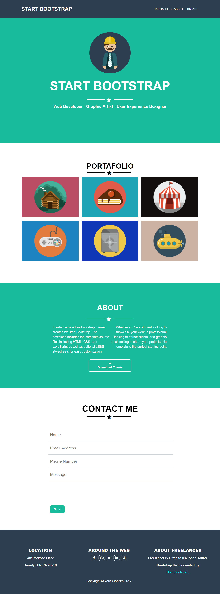

# Freelancer

* **Track:** _Common Core_
* **Curso:** _Creando tu primer sitio web interactivo_
* **Unidad:** _Maquetado web con HTML & CSS_

***
## PROCEDIMIENTO:
1._Crear una carpeta donde se guardaran los archivos, dentro de esa carpeta creamos dos carpetas mas, una se llamara `assets` y dentro de esta carpeta se encontrara la carpeta `images` donde guardaremos nuestras imagenes, la otra carpeta creada se llamara `css`, en esta carpeta guardaremos todos nuestros archivos `css` y en la carpeta general guardaremos nuestros archivos `html`._

2._Despues de haber creado nuestras carpetas, ahora comenzemos con una estructura basica de `html`,  comenzaremos a estructurar deacuerdo a la pagina original de **freelancer**._

3._Ahora en nuestro archivo `css` crearemos clases para darle estilos a nuestro `html`."Es importante vincular nuestro archivo `css` con nuestro `html`"._

4._Para poder insertar los iconos requeridos de **Freelancer**, buscamos en **FontAwesome**,copiamos los links y los pegamos donde o requiera._

5._Finalmente, se entrega el la replica de la pagina de **Freelancer**.

## Complicaciones:
* Al principio se complico un poco la parte en la que tuve que aplicar la estrella con el br, pero revisando en la pagina original, pude darme cuenta de mis errores y de las cosas que no estaba aplicando.   

* Tambien tuve algunos problemas con el centrado de mi formulario, aplique una clase a mi **div** que contenia todos mis **imputs** y pude solucionarlo.

## Finalmente este fue mi resultado:
***
# Freelancer Original!!

# Replica de Freelancer!!

